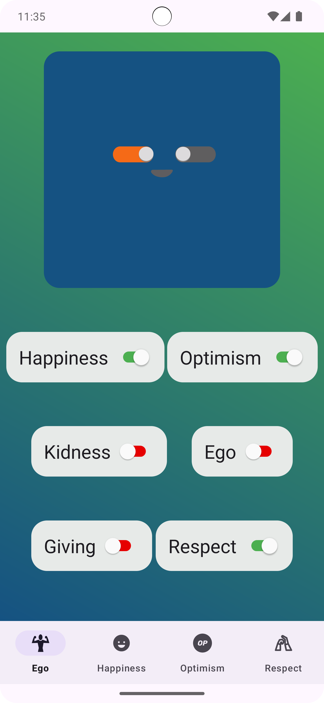

## Kekod Switch App

Kekod Buggy House topluluğunda yapılan proje yarışmasında yapılması istenen ilk proje

### Projede Unit testler ve Compose için de UI testleri yazıldı

## Proje Özeti

Bu proje, Android'de Jetpack Navigation ve çeşitli UI bileşenlerinin kullanımını içeren basit bir uygulamadır. 
Uygulama, kullanıcı etkileşimlerini yönetmek için Switch bileşenleri ve BottomNavigationBar'dan oluşur. 
Proje, Android geliştiricilerine UI bileşenlerinin yönetimini öğretmeyi amaçlayan bir örnek uygulama olarak tasarlanmıştır.

### Projenin İşlevselliği

1. **Switch Yönetimi:**  
   - Uygulama açıldığında kullanıcıyı 6 adet Switch karşılar. Bu Switch'lerden "Ego" Switch'i varsayılan olarak açık gelir.  
   - "Ego" Switch'i açık olduğunda, diğer 5 Switch pasif olur ve açılamaz. "Ego" kapatıldığında diğer Switch'ler açılabilir hale gelir.

2. **BottomNavigationBar Görünümü:**  
   - "Ego" Switch'i kapalı olduğunda, ekranın alt kısmında BottomNavigationBar görünür hale gelir. "Ego" Switch'i açıkken BottomNavigationBar görünmez.

3. **Switch Ekleme:**  
   - Switch'ler kapalı ekranda görünürken, kullanıcı bir Switch'i açtığında bu Switch'e ait ikon ve metin, BottomNavigationBar'a eklenir.  
   - İkonlar açılma sırasına göre BottomNavigationBar'da görünür, önceden belirlenmiş bir sıralama yoktur.

4. **Slot Yönetimi:**  
   - Switch'lerin bulunduğu ana ekran, BottomNavigationBar'da her zaman 1. slotta yer alır.  
   - Geriye kalan 4 slota, kullanıcı hangi Switch'leri açarsa sırası ile eklenir. En son açılan Switch eklenmez.

5. **Dinamik Navigasyon:**  
   - Switch butonları kapatıldığında, BottomNavigationBar'a eklenen öğeler kaldırılır.  
   - BottomNavigationBar'daki her bir öğeye tıklandığında, ilgili detay ekranına gidilir ve her ekran çeşitli içeriklerle doldurulur.

## Proje Compose ve View Versiyon

Projeyi hem View hiyerarşisi ile hemde Jetpack Compose ile yazıldı. Projede Compose ve View arasında geçiş yapmak için [MainActivity.kt](https://github.com/tolgaprm/KekodSwitchApp/blob/master/app/src/main/java/com/prmto/kekodswitchapp/ui/MainActivity.kt)
içerisinde `onCreate()` fonksiyonu içerisinde:

- View sistemi versiyonunu çalıştırmak istiyorsanız `setViewVersion()` şeklinde çağırımı yapınız.
```kt
override fun onCreate(savedInstanceState: Bundle?) {
        super.onCreate(savedInstanceState)
        setViewVersion()
    }
```
- Compose versiyonunu çalıştırmak istiyorsanız `setComposeVersion()` şeklinde çağırımı yapınız.
```kt
override fun onCreate(savedInstanceState: Bundle?) {
        super.onCreate(savedInstanceState)
        setComposeVersion()
    }
```
## Ekran Görüntüleri


|                                   |                                    |                               |                                               | 
|---------------------------------------------------------|-----------------------------------------------|--------------------------------------------------------------------------|------------------------------------------------------------------------------|
|  |  |  |  |
